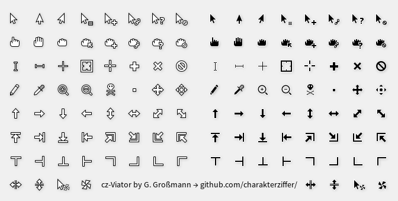
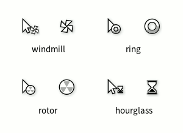

# Toolbox for X11 Mouse Cursors

This collection of files enables you to create a Linux cursor theme out of an SVG file. I used it to build my cursor theme cz-Viator (included in this package).

Maybe you don’t want to build your own theme and just download mine? I’ve prepared the [white cz-Viator](assets/cz-viator.zip?raw=true) and the variant [cz-Viator (Black)](assets/cz-viator-black.zip?raw=true). For Windows I made a trimmed-down version: [cz-Viator WIN](assets/cz-viator-WIN.zip?raw=true) and [cz-Viator (Black) WIN](assets/cz-viator-black-WIN.zip?raw=true). For installing instructions see [step 3](#install) in this *README* file.

Gerhard Großmann (<postfach2b@web.de>), April 2018

## Presettings

Clone or download the files of this repository to your local machine. If downloaded via the green github button top right then unpack the zip file. To render the PNGs the vector editing software **Inkskape** is used. For combining the PNGs to X11 cursor files you’ll need the command line tool **xcursorgen**.

## 1 Designing Your Own Cursors

If you just want to generate a theme out of the provided SVG you can skip this step and proceed with generating the PNGs. Otherwise start by editing the file *template.svg* in the folder *svgs* with Inkscape.

### 1.1 Working with the SVG

The *template.svg* contains three layers. On the layer *cursors* there’s a group of the different cursors. It is cloned to the second, semi-transparent layer *shadow*, slightly translated and blurred. The third layer *slices* contains rectangles with the ID of the individual cursors. It is set to invisible because it should not get rendered as a cursor background.

By the way the colors of the *slices* layer are only important for the example cursor file. They could be helpful if you just want make small edits to the provided theme. Pink signals that this cursor contains or consists of cloned other cursors. Teal means that this cursor doesn’t follow the standard of 1px black stroke, white filling. It may contain blurred shadow lines, other colors, stroke widths or areas without an outline.

### 1.2 Setting hotspots

For each cursor you have to determine the spot where the mouse tip is located. It is described in a file in the folder *hotspots*. Each cursor has one file with lines like

    24 11 1 ../pngs/24/center_ptr.png
    32 16 2 ../pngs/32/center_ptr.png
    48 22 2 ../pngs/48/center_ptr.png

These stand for [size] [x coordinate] [y coordinate] [path to png]. The path later is important for combining different sized PNGs to one cursor file. It’s relative to the *hotspots* folder.

To get the coordinates in Inkscape make the *slices* layer visible and turn on a pixel grid. The top left pixel has the coordinates 0 0, the top right one has 23 0. So you can count where the mouse tip should sit.

For the animated cursors the frames duration is added to the end of each line. If you want each frames take 60 milliseconds then write

    24 11 11 ../pngs/24/wait-01.png 60
    24 11 11 ../pngs/24/wait-02.png 60
    24 11 11 ../pngs/24/wait-03.png 60
    24 11 11 ../pngs/24/wait-04.png 60
    ...

## 2 Generating the Theme

If you edited the *template.svg* make sure the layer *slices* is invisible. Then open a terminal and navigate to the *cursor-toolbox* folder using the command `cd /path/to/cursor-toolbox`. Now we’re ready to go!

### 2.1 Rendering the PNGs

The Python file *render-pngs.py* combs through *template.svg* and searches for rectangles on the *slices* layer. It exports the vectors in these areas to PNGs named after the rectangle’s ID. To start rendering use the command

    ./render-pngs.py svgs/template.svg

Or, if you prefer the black-theme:

    ./render-pngs.py svgs/template-black.svg

This creates the folder *pngs* with all the images – it may take some time. If you want other sizes than 24×24, 32×32 and 48×48 then edit the lines 68, 74 and 75 in *render-pngs.py* before.

### *2.2 (optional) Different Spinners*

The animated cursor of my theme cz-Viator is a rotating windmill. However I’ve created some alternative designs (there are black variants, too):

If you’d like to employ one of these, now it’s the right time! Let *render-pngs.py* do it’s work again, only using the preferred spinner file this time (*one* of these lines):

    ./render-pngs.py svgs/spinner-hourglass.svg
    ./render-pngs.py svgs/spinner-ring.svg
    ./render-pngs.py svgs/spinner-rotor.svg
    ./render-pngs.py svgs/spinner-windmill.svg

… or with the equivalent variant \*-black.svg. The PNGs of the cursors *wait* and *progress* will be overwritten.

### 2.3 Merge the PNGs to cursor files

We use the shell script *make.sh* to combine the right PNGs and generate X11 cursor files. The script also creates the correct folder structure and symbolic links for a ready-to-use theme.

To name your theme open *make.sh* with your prefered text editor. Fill in your own theme name in line 6 (`themetitle='My Cursor Theme'`). Save and close *make.sh*. Now run the file with the command

    ./make.sh

Your finished cursor theme is in the new folder with your given name. (For the next steps I’ll call that “theme folder”).

### *2.4 (optional) Recreating Your Cursor Theme for Windows and Mac*

If somebody knows how to do that for Mac, please let me know.

**For Windows:** Keefer Rourke gave me a hint how to convert PNG images to Windows cursors. For his capitaine theme he used the free Windows software [Real World Cursor Editor](http://www.rw-designer.com/cursor-maker). A fair warning: Using that Editor is in no way as fast and easy as combining the PNGs with a simple shell command.

Furthermore the Windows theme apparently can contain only a subset of the cursors, namely: left_ptr, help, pointing_hand, text, crosshair, not-allowed, pencil, move, up-arrow, ns-resize, ew-resize, nesw-resize, nwse-resize, progress and wait. In all other cases unfortunately the default cursors are displayed (e. g. zoom, grab, alias, col-resize).

<h2 id="install">3 Installing and Using the Cursor Theme</h2>

### Instructions for Linux

To install the theme for a single user copy the theme folder into the hidden folder *.icons* in your home directory – if neccessary create this folder. You can do this with the terminal, too. Replace the *[theme-folder]* with the name of the generated folder from step 2.3.

    cp -r [theme-folder] ~/.icons/[theme-folder]

To install the cursor theme system-wide, copy your folder to /usr/share/icons. You’ll need to run the command as the system administrator, so you’ll be prompted for your system password:

    sudo cp -r [theme-folder] usr/share/icons/[theme-folder]

Now you have to set your cursor theme as the prefered one. Depending on your Linux distribution use the Gnome Tweak Tool or Unity Tweak Tool (there: Theme Settings).

On KDE Plasma go to Computer > System Settings > Workspace Appearence > Cursor Theme (or similar).

For MATE search at System > Settings > Appearence > Theme …, XFC should be Settings > Mouse and Touchpad > Cursor Theme. There are other possibilities but I can’t list all of them here.

### Instructions for Windows

Unzip the downloaded folder and open in. There you find a file *INSTALL.inf*. Right click it and choose “Install”. It copys the cursor folder to `C:\Windows\Cursors\` and registers the cursors as a new available scheme.

After that you can select the cz-Viator theme. For this right click on your desktop, pick “Customize” in the context menu. In the new window choose Designs, then Mouse cursor. Under Schemes you find “cz-Viator {Black}” in the drop down menu. Select it and confirm your preference with *OK*.

**The Windows cursor theme has some flaws:** My theme has shadows by default, so you can’t use the Shadows setting. I only have produced the default size. If you need your cursors bigger, contact me and I see what I can do. Some cursors can’t (?) be set on Windows. Because of that, cz-Viator for Windows only contains the 15 cursors listed at step 2.4.

## 4 Enjoying the Theme

In the *assets* folder you’ll find a list of the cursors and equivalents, my own cursor themes and the file *test.html*. Open that with a browser and you can watch some of the cursors in action.

To analyse which cursor is displayed I recommend using the theme Dummy X11 Cursors. It can be found at https://www.gnome-look.org/content/show.php?content=128170

If you have further questions, ideas or need some help with my cursor toolbox I’m more than happy to give a hand. Please file an issue here at GitHub or simply mail me at <postfach2b@web.de> and we’ll figure that out 😀.